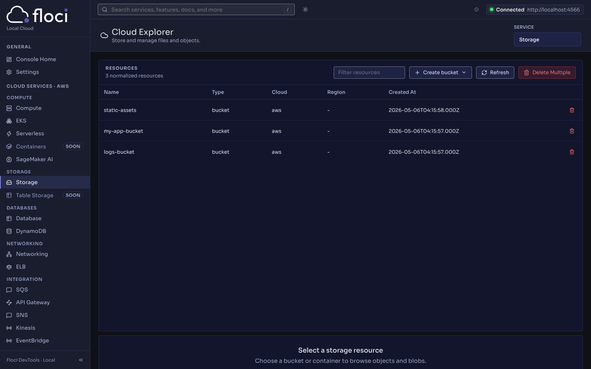
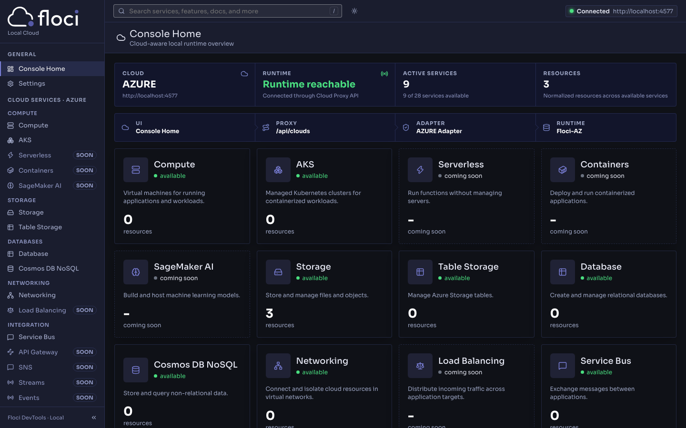
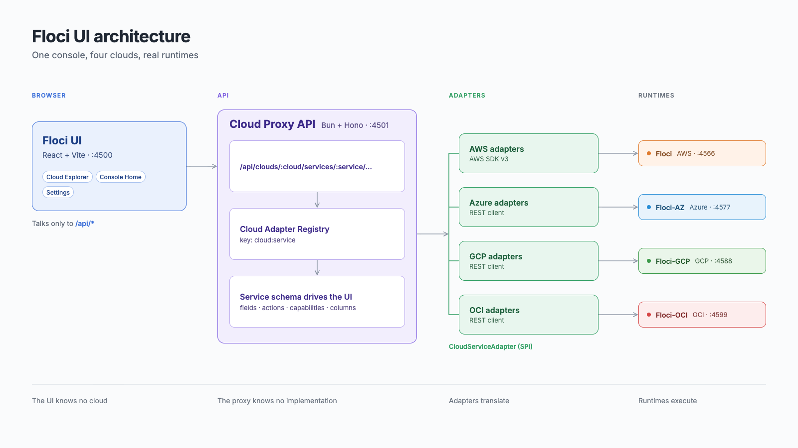

<p align="center">
  
  
</p>

<p align="center">
  <strong>Any Cloud. Locally.</strong><br />
  The web console for Floci: browse and manage AWS, Azure, GCP and OCI resources on your machine.
</p>

<p align="center">
  <a href="https://github.com/floci-io/floci-ui/releases/latest"></a>
  <a href="https://github.com/floci-io/floci-ui/actions/workflows/ci.yml"></a>
  <a href="https://hub.docker.com/r/floci/floci-ui"></a>
  <a href="https://hub.docker.com/r/floci/floci-ui"></a>
  <a href="https://opensource.org/licenses/MIT"></a>
</p>

<p align="center">
  <a href="#quick-start">Quick Start</a> ·
  <a href="#features">Features</a> ·
  <a href="#supported-services">Services</a> ·
  <a href="#architecture">Architecture</a> ·
  <a href="#development">Development</a> ·
  <a href="#troubleshooting">Troubleshooting</a>
</p>

<p align="center">
  
</p>

---

## What is Floci UI?

A Web UI for the [Floci](https://github.com/floci-io/floci) local emulators. It emulates nothing itself: the API turns the UI's requests into real cloud-SDK calls against the runtimes you already run, and the UI shows only what they return. No demo rows, no mock metrics, real empty states.

| Emulator | Cloud | Port |
|---|---|:-:|
| [floci](https://github.com/floci-io/floci) | AWS | 4566 |
| [floci-az](https://github.com/floci-io/floci-az) | Azure | 4577 |
| [floci-gcp](https://github.com/floci-io/floci-gcp) | GCP | 4588 |
| [floci-oci](https://github.com/floci-io/floci-oci) | OCI | 4599 |

## Quick Start

```bash
docker compose up                              # AWS only
docker compose --profile multicloud up         # AWS + Azure + GCP + OCI
```

Open **http://localhost:4500**.

<details>
<summary>Other ways to run it</summary>

**From Floci itself.** Floci starts the console on demand at `http://localhost:4566/_floci/ui` (needs the Docker socket mounted; see the [Floci docs](https://floci.io/floci/ui/)).

**Single image**, UI and API on one port:

```bash
docker run -p 4500:4500 -e FLOCI_ENDPOINT=http://host.docker.internal:4566 floci/floci-ui
```

</details>

## Features

- **One console, four clouds.** Pick the cloud in Settings; the nav is built from what each runtime supports.
- **Generic Cloud Explorer.** List, search, create, inspect (Plain Text, JSON and Table views) and delete, with multi-select and bulk delete. Every service renders from a schema.
- **Honest availability.** A service without an adapter, or one the runtime cannot serve yet, is a disabled row with the reason in its tooltip.
- **Rich workspaces where a flat form is not enough:**

| Area | What you get |
|---|---|
| Storage | Object browser with prefixes, upload, download, copy, delete |
| Databases | DynamoDB, Cosmos DB and Azure SQL / PostgreSQL data explorers with a query editor; RDS update and snapshots |
| Compute | EC2 launch, power actions, AMIs, tags, console output; EKS nodegroups and Fargate profiles; Lambda invoke with tailed logs |
| Networking | VPC wizard, subnets, security groups, gateways, route tables, Elastic IPs |
| Messaging | SQS send, receive and purge |
| Workflows and logs | Step Functions execution history; CloudWatch Logs streams, events and Logs Insights |
| Security | Secrets (reveal on demand), KMS encrypt and decrypt, IAM users, roles and policies |
| Email | SES mailbox with HTML, text and raw MIME preview |
| Settings | Light, dark or system theme; account switcher |

## Supported Services

Generated from the service catalog and adapter registry, so it never drifts. After changing either, run `cd packages/api && bun run scripts/service-matrix.ts`.

| Group | Service | AWS | Azure | GCP | OCI |
|---|---|:-:|:-:|:-:|:-:|
| Compute | Compute | ✅ | ✅ | – | – |
| Compute | k8s Engine | 👁 | 👁 | ✅ | ✅ |
| Compute | Serverless | ✅ | ⏳ | ✅ | ✅ |
| Compute | Containers | – | – | ✅ | – |
| Compute | SageMaker AI | ✅ | – | – | – |
| Storage | Storage | ✅ | ✅ | ✅ | ✅ |
| Storage | Table Storage | – | ✅ | – | – |
| Databases | Database | ✅ | ✅ | ✅ | – |
| Databases | NoSQL | ✅ | ✅ | – | – |
| Networking | Networking | 👁 | ✅ | – | – |
| Networking | Load Balancing | ✅ | – | – | – |
| Integration | Messaging | ✅ | ✅ | ✅ | ✅ |
| Integration | API Gateway | ✅ | – | – | – |
| Integration | SNS | ✅ | – | – | – |
| Integration | Streams | ✅ | – | – | ✅ |
| Integration | Events | ✅ | – | – | – |
| Integration | Email | 👁 | – | – | – |
| Integration | Cloud Scheduler | – | – | ✅ | – |
| Integration | Workflows | ✅ | – | – | – |
| Provisioning | Infrastructure as Code | ✅ | – | – | – |
| Provisioning | Configuration | ✅ | – | – | – |
| Security | Identity | ✅ | – | – | ✅ |
| Security | Cognito | ✅ | – | – | – |
| Security | Secrets Manager | ✅ | ✅ | ✅ | ✅ |
| Security | Key Management | ✅ | – | – | ✅ |
| Security | Parameter Store | ✅ | – | – | – |
| Observability | Logs | ✅ | – | – | – |
| Observability | CloudWatch | ✅ | – | – | – |

✅ list, inspect, create, delete · 👁 read-only or partial · ⏳ adapter registered, runtime gap · – not available

Known runtime gaps (the adapter is ready, the emulator is not):

- Azure Functions: Floci-AZ answers 501.
- RDS `CreateDBSnapshot`: Floci answers 501; listing works.
- AKS clusters never leave `Failed` locally, so AKS stays read-only.

Adding a service is a catalog row, a schema and an adapter, with no frontend change. See [AGENTS.md](AGENTS.md).

<p align="center">
  
</p>

## Architecture




```text
Browser → /api/clouds/* → Cloud Adapter Registry → provider adapter → local runtime
```

The UI knows no cloud, the proxy knows no implementation, adapters translate, runtimes execute. Code lives in `packages/api` (Bun, Hono, AWS SDK v3) and `packages/frontend` (React, Vite).

## Development

Requires Node 22.22+ or 24.15+, pnpm 9+, Bun, and a running Floci (`docker compose up floci` is enough).

```bash
pnpm install
cp .env.example packages/api/.env
pnpm dev                 # UI :4500 + API :4501
```

Before opening a PR:

```bash
pnpm lint && pnpm type-check && pnpm test && pnpm build
```

Frontend e2e tests use mocked `/api/*` and need no emulator: `pnpm --filter @floci/frontend test:e2e`.

### Configuration

Set in `packages/api/.env` (defaults shown).

| Variable | Default |
|---|---|
| `FLOCI_ENDPOINT` | `http://localhost:4566` |
| `FLOCI_AZURE_ENDPOINT` | `http://localhost:4577` |
| `FLOCI_GCP_ENDPOINT` | `http://localhost:4588` |
| `FLOCI_OCI_ENDPOINT` | `http://localhost:4599` |
| `FLOCI_AZURE_ACCOUNT_NAME` / `_SUBSCRIPTION_ID` / `_RESOURCE_GROUP` | `devstoreaccount1` / `00000000-0000-0000-0000-000000000000` / `floci-local` |
| `FLOCI_GCP_PROJECT` | `floci-local` |
| `AWS_REGION`, `AWS_ACCESS_KEY_ID`, `AWS_SECRET_ACCESS_KEY` | `us-east-1`, `test`, `test` |
| `PORT` | `4501` |

## Troubleshooting

| Symptom | Fix |
|---|---|
| `ECONNREFUSED` on `/api/*` | The API is down. Run `pnpm dev:api`, then `curl localhost:4501/api/clouds`. |
| `EADDRINUSE` on 4501 | Another API is running. Stop it first. |
| Cloud shows `Not connected` | Check the runtime: `curl localhost:4566/_floci/health` (Azure `:4577/_floci/health`, GCP `:4588/_floci-gcp/health`, OCI `:4599/_floci-oci/health`), then `curl localhost:4501/api/clouds/<cloud>/status`. |
| One service is unavailable | `curl "localhost:4501/api/clouds/<cloud>/status?services=all"`. `errorCode` tells you why: `operation_not_implemented` (the runtime lacks it), `runtime_unavailable` (unreachable), `operation_not_supported` (no adapter). |
| AWS auth errors | Keep `AWS_ACCESS_KEY_ID` and `AWS_SECRET_ACCESS_KEY` as `test`, matching the runtime. |

## Contributing

Read [CONTRIBUTING.md](CONTRIBUTING.md) and [AGENTS.md](AGENTS.md). Prefer the Cloud Explorer and generic SPI over new pages, keep placeholders explicit, and update this README when the visible surface changes.

## Community

[floci-dash](https://github.com/ofsazib/floci-dash) is a community AWS dashboard on Cloudscape with an EC2 web terminal (AWS only). Built something for Floci? Open a PR to list it.

## License

[MIT](LICENSE), part of the [Floci](https://floci.io) ecosystem.
